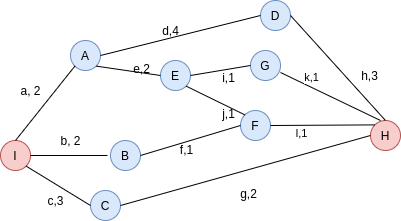

# Design your own Google Map

## Table of Contents
1. Introduction
2. Stored Data
3. Preprocessing
4. Computing Quickest/Shortest Path
6. Efficiency and Feasibility
7. References
8. Conclusion

## Introduction
<b>Google Maps</b> has continued to ease our lives for many years with new features coming up from time to time. Even thinking of developing something equally powerful is a big challenge in itself. Obviously the algorithms and tools used by Google won't be disclosed any sooner, the only thing we can do is to try thinking in the right direction which might lead us to a solution of our own.

Trying to exploit some different tools, I decided to use the <b> Boolean Constraint Satisfaction </b> technique in order to fetch the shortest path. It may not be very good in terms of time complexity, but it certainly gives the flexibility to add/remove different filters to your search in the form of boolean constraints.


### Boolean Satisfiability
Boolean Satisfiability has become quite popular lately. In fact, many problems are more convenient to model and solve using boolean algebra as compared to traditional ILP using [CPLEX](https://www.ibm.com/analytics/cplex-optimizer) like solvers. 

To give a basic description of how boolean satisfiability works, we take a set of boolean variables and the boolean constraints in [CNF](https://en.wikipedia.org/wiki/Conjunctive_normal_form) form. Initially, all the boolean variables are unassigned and the aim is to find a satisfying assignment for the variables such that all the constraints are satisfied or return that "no such assignment exists which satisfies all the given constraints", if that's the case. SAT problems are NP-complete, thus all the known algorithms ([DPLL](https://en.wikipedia.org/wiki/DPLL_algorithm), [CDCL](https://en.wikipedia.org/wiki/Conflict-driven_clause_learning), etc) to solve SAT problems have exponential worst-case complexity, however, it can be improved a lot using Heuristic functions.

#### My own implementation of a DPLL based SAT solver can be found at [github.com/Manvi07/SATSolver](https://github.com/Manvi07/SATSolver).

### Pseudo-Boolean Satisfiability
Recently, the Boolean Satisfiability Problems have been extended to something known as <b>Pseudo-Boolean Constraints Satisfaction</b>. This method makes it very easy to model complex constraints due to the high expressive power of PB constraints and equips the normal SAT solvers with the ability to handle Boolean Optimization problems, in which we need to maximize or minimize a given function. 

Mathematically, a pseudo-boolean function can be represented as follows:
 
f : B<sup>n</sup> → <b>R </b>

where, `B` = {0, 1} and `n` is a non-negative integer.

Maximizing/Minimising the pseudo-boolean function is NP-Hard and cannot be achieved using the traditional SAT solvers.

 ### General Algorithm for PB-SAT Problems as decribed in [[3].](https://www.inesc-id.pt/ficheiros/publicacoes/5226.pdf)
 ```
while TRUE do
    if DECIDE() then
        while DEDUCE()=CONFLICT do
            blevel ← AnalyseConflict()
            if blevel <= 0
                return UNSAT
            else
                BACKTRACK(blevel)
            end if
        end while
    else
        return SAT
    end if
end while
 ```

A _decision level_ refers to the last assignment made in the depth in a decision tree. The `DECIDE` function decides the assignments at the current decision level, extending the existing set of partial assignments. 

If all the variables are assigned and there is no conflicting assignment, it means that we have found a solution, thus return SAT. Else, we call the `DEDUCE` function which applies BCP, and if there's a conflict we need to `BACKTRACK` to the second last _decision level_. Also, a `learned clause` is added to the existing set of clauses, and the procedure continues. 


## Stored Data
We store the World Map in the form of a graph in which nodes represent the places/regions and edges represent the paths/ways/roads between these nodes. The edges are weighted by a `Cost`, that is computed using `geographical distance` and `live traffic` so that the cost has contributions from both. Thus, we aim to find the shortest route with the least traffic. 

`Cost = f(dist, traffic)`
 
Here, `f(x,y)` is a function of the type `ax + by`, and the values of `a` and `b` decide, how much a factor affects the cost.

Thus a node may be defined as:
```
struct Node{
    string place_name;
    bool ID;
    pair<double, double> latitude, longitude; 
    vector<struct Node>neighbors;   
};
```

Next, we store the following attributes for each edge:
```
struct Edge{
    string path_name;
    bool ID;
    struct Node source, destination;
    double cost;
};
```
We also need to define a data structure that holds all the Nodes and Edges in order to answer any kind of <b> Search queries </b>. Let's have a class with helper functions such as `AddNode`, `DeleteNode`, etc.

```
class Graph{

 public:
    set<struct Node>graph; 
    void AddNode(struct Node n)
    {
        Struct Node A = {"IIT", 0, {28, 5436}, {77, 1986}, {"B, "C"}};
        graph.insert(A);
        update_edges(A);             // To add the new edges
    }
    ...
    ...
    ...
};
```

## Preprocessing
The raw data can not be directly taken as input. Thus, we process the input to modify the format according to our data structure and define the graph carefully with all the nodes & edges storing the above-mentioned attributes, along with calculating the `Cost` for each edge.

Let's consider the following example graph to understand the problem better:



Here, we have taken capital letters to denote the boolean variables for nodes and small letters to denote edges. (For simplicity, `A` has been used in place of `A.ID` in the next sections.)
We go from node <b>`I` (source)</b> to <b>`H` (destination)</b> using the path that minimizes the total cost. Initial assignments would be `0`. We begin with the problem formulation in the next section.

## Computing Quickest/Shortest Path
As introduced, we find the Shortest path by modeling the problem in the form of <b>Boolean & Psedudo-Boolean Satisfiability Constraints</b>. The boolean ID associated with the node represents the boolean variable. <b> The value 1 of the ID means that the node will be a part of the best path and 0 means that it's not. </b> We need to satisfy the following constraints:
1. For the source and the destination, <b> exactly 1 </b> edge can be a part of the path.
<b> E.g. </b> here, exactly one of {a, b, c} can be true. We can model this as a psedo-boolean constraint as follows:
   
   `a + b + c = 1` 
   
   `h + k + l + g = 1`
   
   Or as a boolean constraint as follows:
```
   P: (a ∨ b ∨ c) ∧ (¬a ∨ ¬b) ∧ (¬b ∨ ¬c) ∧ (¬c ∨ ¬a)

   Q: (h ∨ k ∨ l ∨ g) ∧ (¬h ∨ ¬k) ∧ (¬k ∨ ¬l) ∧ (¬l ∨ ¬g) ∧ (¬g ∨ ¬h)

   P ∧ Q
   ```

2. All other nodes, other than the source and the destination, should satisfy exactly one of the following conditions:

    (i) <b>The node is a part of the shortest path: </b> In this case, exactly 2 connecting edges from that node will be a part of the path, i.e. for node A,

    `a + e + d = 2`
    
    (ii) <b> The node is not a part of the shortest path: </b> When the boolean ID associated with that node as well as that of all the associated edges is <i>false</i>, i.e.

    `A + a + e + d = 0`

   The above 2 pseudo-boolean costraints can be combined as follows:
   
   `2Ā + a + e + d = 2; where (Ā is equivalent to ¬A)`

   In the boolean format:
```
   P: (a ∧ e)
   
   Q: (e ∧ d)
   
   R: (d ∧ a)
   
   (¬A ∨ P ∨ Q ∨ R) ∧ (A ∨ ¬P) ∧ (A ∨ ¬Q) ∧ (A ∨ ¬R) ∧ (¬P ∨ ¬Q) ∧ (¬Q ∨ ¬R) ∧ (¬R ∨ ¬P)
```

   P.S. Here comes a thought that if `a` and `d` are true, the above constraint will be satisfied, and thus, the solver would return a result which is technically false. But on thinking a bit deeper, it can be realized that the other 2 constraints would never let that happen :)

3. The contraints till now can be easily solved by a CDCL SAT solver. Now we need to find the path that minimizes the overall cost, for which we need to minimise the sum of edge variables. Here, comes the need of the Pseudo-Boolean Solver. The optimisation function, `h` can be formulated as follows: 

   `min(2a + 2b + 3c + 4d + 2e + f + 2g + 3h + i + j + k + l)`
 
Minimization of Linear the Pseudo Boolean function can be achieved using the method of <b>Partially Minimizing Points</b> as described in [[5].](https://link.springer.com/chapter/10.1007/978-3-642-85823-9_6)

<!-- As introduced, we know that a PB function is a real valued function with bi-valent (0, 1) variables. 
Let there be a vector, <b>v : (x1, x2, ..., xn) ∈ B<sup>n</sup></b>, such that the function `c1x1 + c2x2 + c3x3+ ... + cnxn` reaches its global minimum at `v`, which is defined as follows: 

```
for(int i=1; i<=n; i++)
{
    if (ci < 0)
        xi = 1;
    else
        ci = 0;
}
``` -->
<!-- 
Now, if our optimisation function is subject to certain other (linear or non-linear) constraints, as it is in our case, we follow 3 main steps:

1. Calculate families of solution from the given set of constraints (F<sub>1</sub>, F<sub>2</sub>, ..., F<sub>p</sub>).
2. For each family `F`, determine `{min[f(X)] ∀(X ∈ F)}` and the points X<sup>0</sup> ∈ F, for which f(X<sup>0</sup>) = {min[f(X)] ∀(X ∈ F)}. These points are called _partially minimizing points_.
3. Determination of `{min{min[f(X)] ∀(X ∈ Fk)} ∀k}`. -->

### Efficiency & Quick Routing
There is definitely a trade-off between accuracy and speed. The above algorithm can have exponential time complexity in worst-case, hence not suitable for quick routing in case the user takes a wrong turn. 

However, since the last constraint is the main bottleneck, in that case, we can avoid the constraint for the "shortest path" and find a "possible path" quickly, because it is very easy to add more constraints due to the boolean formulation.

E.g. if we want to include a stop, `A` in the journey, we can simply add the constraint, `A = 1`, and give it to the solver.


## Efficiency and Feasibility
The efficiency of the algorithm is highly affected by the solver being used, most SAT Solvers spend most of their time in the Boolean constraint Propagation and backtrack procedures [[1]](https://pdfs.semanticscholar.org/25f4/f10752f0217c0accfc2f25077c6675ca1e7e.pdf
). In general, it would work very good in case of small data, would slow down otherwise.


Given, the capacity of currently existing SAT solvers, the solution cannot work on the scale of the globe, and was just a theoretical idea. Maybe, in the future, when we can have highly efficient SAT and PB-SAT solvers which can give us results much faster, we can think of using this technique.

## References
[1]. [Fadi A. Aloul, _" On Solving Optimization Problems Using Boolean Satisfiability"_, 2005](https://pdfs.semanticscholar.org/25f4/f10752f0217c0accfc2f25077c6675ca1e7e.pdf)

[2]. [Fadi A. Aloul, Bashar Ali Rawi, and Mokhtar Aboelaze, _"Identifying the Shortest Path in Large Networks using Boolean Satisfiability"_](https://www.eecs.yorku.ca/~aboelaze/publication/ABA06.pdf)

[3]. [Jośe Santos, and Vasco Manquinho, _"Learning Techniques for Pseudo-Boolean Solving"_](https://www.inesc-id.pt/ficheiros/publicacoes/5226.pdf)


[4]. [Wikipedia, Pseudo-Boolean function](https://en.wikipedia.org/wiki/Pseudo-Boolean_function)

[5]. [Peter L. Hammer and Sergiu Rudeanu, _"Boolean Methods in Operations Research and Related Areas"_, Chapter 5"](https://link.springer.com/chapter/10.1007/978-3-642-85823-9_6)

## Conclusion

The approach described in this solution is experimentally verified to work for a graph with 20 to 500 nodes using the [PBS4](http://www.aloul.net/Tools/pbs/pbs4.html) SAT solver, which can handle both, CNF and PB constraints. It is guaranteed to find the shortest path in a finite time given sufficient memory resources.

It is definitely not the most efficient, but given proper thought on the problem heuristics and a little more background on Pseudo-Boolean Satisfiability, we can highly improve it to be able to use in real-world routing problems.
