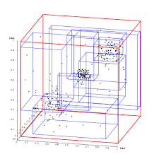
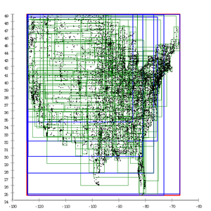
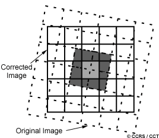
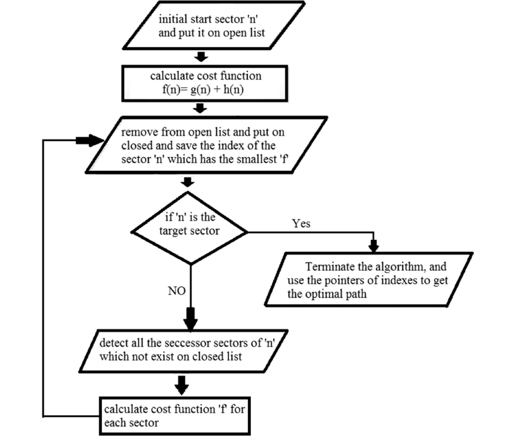
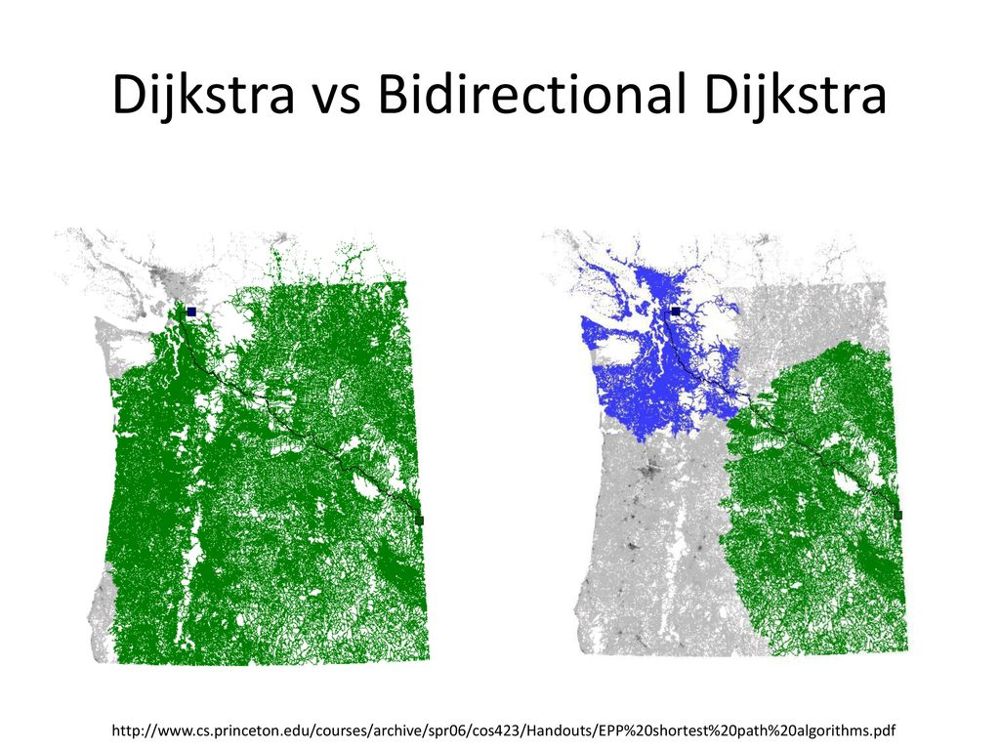
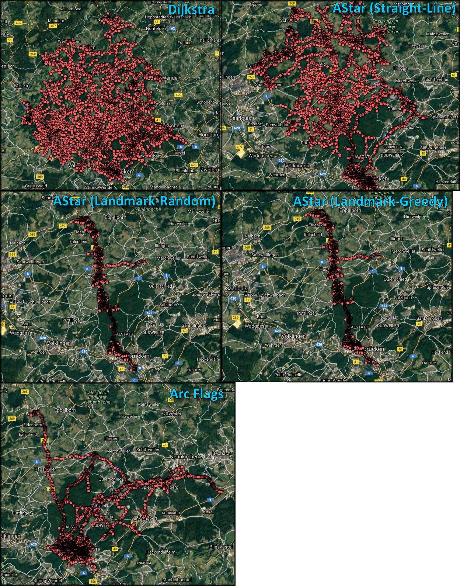

# Design your own Google Map 

 
## Table of Contents 

1. Introduction 

2. Stored Data 

3. Preprocessing 

4. Computing Quickest/Shortest Path 

6. Efficiency and Feasibility 

7. References 

8. Conclusion 

 
 

## Introduction 

Google maps are an excellent example of organising scattered world data and using that data to provide a navigational/surveyal service . 

 ## Hey I have designed keeping in mind ->  "We call all the inquisitive minds to this design competition where you have to come up with a design document explaining how Google Maps work. Google Maps works on a proprietary algorithm. Your task is to come up with a detailed document with, whatever you think, happens behind the scenes when you use the application ."  

 ##  It means it's more than calculating shortest route problem :) .
 

Lets dive into my design logic . 

 Well to develop Maps as a service there are some things to keep in mind .
 

1. We need to capture loads and loads of spatial data with most crisp image like the image u see when u have max zoom over a place and u are able to spot a chair / tree / person . 

2. I am going to call each layer a zoom level which will seperately have all its database organised in a format i'll explain below and this will be discrete for all layers .

Ex : 
- Zoom 0 : U see continents mainly (images , names of continents and some countries , their coordinates based map representation , terrain features)
- Zoom 1 : Now u see mainly countries and sometime their capitals too ( u know what i mean .)
- Zoom 2 : Now states geographical data .

3. Lets store the data using appropriate data structures and format . 

~~We really can't store the data in the heirarchy of COUNTRIES -> STATES -> CITIES -> ROADS , PATHWAYS , TRACKS , PARKS because then u literally need to overlap Coordinates , with places why do that~~ ?

**Basically we need to use a heirarchy of coordinates as keys with values having names of Places**
ex:

-                        (67 N 54 E => State ) 

                                   |
                                   
 (67.1 N 54.1 E => City a), (67.2 N 54.2 E => City b), (67.3 N 54.3 E => City c), 

          |
          
 (67.11 N 54.11 E => street a),(67.12 N 54.12 E => street b),(67.12 N 54.12 E => street c)
. 
.
.
So on 

-Now this heirarchy needs to be followed at every zoom level

This way we will be having a fool proof mapping system , u see we will be able to find nearest neighbors and everything far too easily using an R Tree this way

4. Relay the information to the user using OFFLINE CACHING IN MEMORY / CLOUD PROCESSING when he/she wanna search a place /reach a place .  

- **warning : Basically we need to capture the entire earth 'n' no of times and Flattening the earth and still being accurate and not a DJIKSTRA's Algorithm**
**where 'n' is the no of zoom levels and all the data captured then needs to sorted via data structure(R* Tree), with root being in the layer where ZOOM Level=0** 

*Here our aim is to REPLICATE AS MANY SERVICES OF GOOGLE MAPS AS POSSIBLE* .
 
 

## Stored Data 

- Data Attributes - 

Zoom level , Google Tile coordinate , World Coordinate , Pixel Coordinate . 

Eg: 

- Chicago, IL 
- Lat/Lng: (41.85, -87.65) 
- Zoom level: 3 
- World Coordinate: (65.67111111111112, 95.17492654697409) 
- Pixel Coordinate: (525, 761) 
- Tile Coordinate: (2, 2) 

- *ZOOM LEVEL*-  how much we wanna zoom into the map . 

- *WORLD COORDINATE*- the exact coordinate of a place using Mercator projection .    

- *GOOGLE TILE COORDINATE* –Google has divided the map into zones / tiles (16 of them ) and u need a tile coordinate to access images of that place . 

   

- *PIXEL COORDINATE*- Pixel coordinates reference a specific pixel on the map at a specific zoom level, whereas world coordinates reflect absolute locations on a given projection. Pixel coordinates are calculated using the following formula: 

// **pixelCoordinate = worldCoordinate * 2^zoomLevel** . 

LET’s STORE THIS DATA . 

Lets assume for a moment we dont wanna search or zoom into oceans and wherever it's sea water we are gonna show a blue image but yeah we are gonna map the land wherever it is be it an island . 

 
 

Removing 70% water and other non-interesting area, we are left with 10% area that should be actually mapped ~ 50 million km^2 = 5x107 km^2  

 
 

- Lets say we have one image for each 10mx10m block, and size of each such image is 1 MB (I am quite sure it's less than that due to compression algorithms of google XD ). 

- Assuming 2 road-names and 1 building-name per image: 300 bytes per image 

- We can ignore such contextual information in regards to the actual image size of 1 MB 

- We will have 100x100 such blocks per km^2, so 10,000 MB of images per km^2 

- For 5x10^7 km^2, we will need 5 * 1011 MB space which is ~ 1012 MB = 1000 PB 

 

*WE ALSO NEED TO STORE THE ZOOM LEVELS AND HAVE IMAGES STORED FOR THAT ZOOM LEVEL , CAN'T ALWAYS RELY ON IMAGE PROCESSING ALGO FOR REALTIME EFFICIENCY* . 

Let's have a Zoom level of 2 (assume)  and move outwards .

1000 PB/2 =500PB                                 

500 PB /2=250 PB 

250 PB/2=125 PB 

125 PB/2=62.5 PB 

62.5 PB/2=31.25 PB                                => Approaching the least zoom level(when you can practically see the continents on your screen)

Some 30-35 PB more ie around  2000 PB (approx) . 

Now this might seem lot of data trust me that is the worst case scenario data assumption ruling out compression algorithms . But this much amount of data is common these days , remember in 2014 yahoo said it was storing 500 PB in 40,000 servers . 

Lets go forward with 2000 PB now  and say they are storing this data on around 1,20,000 server nodes . 

DATA STRUCTURE TO USE-  We need to use R* Tree to store  "GDF"  

- **Geographic Data Files** : 

Maps are stored as graphs, or two dimensional arrays of objects with attributes of location and category, where some common categories include parks, roads, cities, and the like. 

A map database represents a road network along with associated features. Map providers can choose various models of a road network as a basis to formulate a database. Commonly, such a model comprises basic elements (nodes, links and areas) of the road network and properties of those elements (location coordinates, shape, addresses, road class, speed range, etc.). The basic elements are referred to as features and the properties as attributes. Other information associated with the road network is also included, including points of interest, building shapes, and political boundaries. This is shown schematically in the adjacent image. Geographic Data Files (GDF) is a standardized description of such a model.

- **R TREE** - 

In range searching, the input is a search rectangle (Query box). Searching is quite similar to searching in a B+ tree. The search starts from the root node of the tree. Every internal node contains a set of rectangles and pointers to the corresponding child node and every leaf node contains the rectangles of spatial objects (the pointer to some spatial object can be there). For every rectangle in a node, it has to be decided if it overlaps the search rectangle or not. If yes, the corresponding child node has to be searched also. Searching is done like this in a recursive manner until all overlapping nodes have been traversed. When a leaf node is reached, the contained bounding boxes (rectangles) are tested against the search rectangle and their objects (if there are any) are put into the result set if they lie within the search rectangle. 

For priority search such as nearest neighbor search, the query consists of a point or rectangle. The root node is inserted into the priority queue. Until the queue is empty or the desired number of results have been returned the search continues by processing the nearest entry in the queue. Tree nodes are expanded and their children reinserted. Leaf entries are returned when encountered in the queue. This approach can be used with various distance metrics, including great-circle distance for geographic data.

 
 
  
  compiled R tree in 2D rect.

 

Suppose we need to find place around a point of interest then: 

*A QUADTREE is a data structure that's useful for finding points near a single point, by searching inside an area surrounding the point of interest*. 

## Important - we can't use a normal mysql database Why ?

Just think for yourself , using so much world data and using joins would be cumbersome hence we need DISTRIBUTED CLOUD SYSTEMS .

**YUP that's why Google invented Google cloud database named -------------BigTable-------------**

The main advantages are: - Join operations are less costly because of the denormalization - Replication/distribution of data is less costly because of data independence (ie, if you want to distribute data across two nodes, you probably won't have the problem of having an entity in one node and other related entity in another node because similar data is grouped) :)  .

This kind of systems are indicated for applications that need to achieve optimal scale (ie, you add more nodes to the system and performance increases proportionally). In an RDBMS like MySQL or Oracle, when you start adding more nodes if you join two tables that are not in the same node, the join cost is higher. This becomes important when you are dealing with high volumes.

RDBMS' are nice because of the richness of the storage model (tables, joins, fks). Distributed databases are nice because of the ease of scale.

 
 
 

## Preprocessing 

There must be a lot of preprocessing going on to achieve instantaneous results. Right? 

Let’s say we are google so what will we do – I'd say get the data (images) from government’s of various countries ie data from their satellites , mapping companies which is what exactly google does . 

It acquires data from TeleAtlas and has partnered with various governments .  
Consistent spatial and temporal calibration allows trends in land-cover to be quantified, enables automation of forest cover characterizations, and leads to reduced ground data requirements because areas with similar characteristics are easier to identify.
Radiometric calibration can be absolute where radiometric values are converted to a geophysical standard quantity such as surface reflectance, or relative where radiometric values are adjusted to a reference standard by comparing the reference ground reflector signatures to see if there are significant differences between sensors. Images need to be calibrated to the reference so that pixels in different images can be compared directly, no matter on which day or season the image was collected or under what sun-sensor-target geometry. The viewing geometry varies significantly across the path of the satellite resulting in very different reflectance values for the same land cover feature.

*Other Preprocessing includes noise reduction , balancing illumination , sharpness of satellite images .*

- STRIP PROCESSING :

The strip processing of satellite imagery is based on the fact that during one pass, the image data stream forms one single very long image. The geometry of this extended image can be rectified with as few control points as for only one scene if orbital constraints and attitude measurements are properly taken into consideration. This is an extension of the single scene adjustment Determination of overlap of imagery joins is made automatic using the image co-ordinates . As the images of one strip have been registered continuously, they coordinate of any point common to two images is the same. Identifying common points of two images and
measuring their x coordinates in each of the two image coordinate systems allows the calculation of the overlap. 

Now using data from TMC (Traffic message Channel)  we are going to take out attributes such are roads /paths .(remember a smartphone is just a sensor for google relaying data so that it can say where there is a jam , where there is a clear road ) . 

**REMINDER - A man used TMC from 100 phones to show a jam :)**

*Now these attributes of Roads/Paths are stored with image data in the GDF* . 

 
 

## Computing Quickest/Shortest Path 

- BRIEF EXPLANATION -  

Google Maps uses <h3 A* algorithm > for finding the shortest path and alternates routes in real time. A* algorithm is an advanced form of Breadth first search . It avoids costly path and choose the most promising path . It is a very smart algorithm. It is used approximate the shortest path in real-life situations, like- in maps, games where there can be many hindrances. It is formulated in terms of weighted graphs in case of google map this weight is travel time. Starting from a specific node(source node) of a graph, it constructs a tree of paths starting from that node, expanding paths one step at a time, until one of its paths ends at the predetermined destination node. 

At each iteration of its main loop, A* needs to determine which of its partial paths to expand into one or more longer paths. It does so based on an estimate of the cost (total time taken) still to go to the goal node. Specifically, A* selects the path that minimize. 

**f(n)=g(n)+h(n)**

  

- A* Search Algorithm
1.  Initialize the open list
2.  Initialize the closed list
    put the starting node on the open 
    list (you can leave its f at zero)

3.  while the open list is not empty
    a) find the node with the least f on 
       the open list, call it "q"

    b) pop q off the open list
  
    c) generate q's 8 successors and set their 
       parents to q
   
    d) for each successor
        i) if successor is the goal, stop search
          successor.g = q.g + distance between 
                              successor and q
          successor.h = distance from goal to 
          successor (This can be done using many 
          ways, we will discuss three heuristics- 
          Manhattan, Diagonal and Euclidean 
          Heuristics)
          
          successor.f = successor.g + successor.h

        ii) if a node with the same position as 
            successor is in the OPEN list which has a 
           lower f than successor, skip this successor

        iii) if a node with the same position as 
            successor  is in the CLOSED list which has
            a lower f than successor, skip this successor
            otherwise, add  the node to the open list
     end (for loop)
  
    e) push q on the closed list
    end (while loop) 

 

*where n is the destination node on the path, g(n) is the cost of the path from the start node to n, and h(n) is a heuristic that estimates the shortest path from source to the destination. The heuristic is problem-specific. In this case it is time taken to reach somewhere.* 

- Bi-directional DJIKSTRA
 This is a somewhat more effective optimization and almost all route calculation algorithms in the industry use it but not primarily for the performance advantage it brings. It means that the route is computed both forward from the origin (with Dijkstra, A*, reach-based routing, highway hierarchies, contraction hierarchies, or other methods) and backward from the destination. Like A*, the technique reduces the area searched, but more importantly, some more important algorithms (ones using road hierarchies) require it to work. But bi-directional route computations bring their own complications – the algorithm must determine when the two searches have met at a point on an optimum or near optimum route and that’s more complex than it sounds. 

 

## Without any heuristic I believe shortest distance problem is basically plain dijkstra algorithm and computation time would be O(V^2) 
 

**Other Heuristics can be FUEL SAVINGS , TURNS , INTERSECTIONS ,SPEED , NO OF ROAD LANES , HIGHWAY OR NOT etc , TRAFFIC DENSITY .** 

With Heuristics Accuracy will increase as seen below and maybe time also decrease because now we can straight away cancel a route if it violates heuristic and we need not traverse on that route , just see Djikstra below how many points it is traversing for our model so I believe it is subjective and based on our model . 

 
  
  

Yup we will be able  reroute instantly in realtime , cuz now the algorithm calculates shortest route considering our position as the starting point and destination as the ending point . 

Basically ASTAR is built keeping in mind such scenarios .  

 

## Efficiency and Feasibility 

- RENDERING MAP ON PHONES :
The technology could generically be described as a map server. The map server generates a map for the requested location from a large set of pre-generated map tile images covering the entire planet. The map server may overlay data from other databases on top of this. The combination of a map viewer client and geographical database is traditionally called a Geographical Information System (GIS).
As stated, Google generated all of these 256x256 tiles and is just serving the relevant tiles.
The javascript code on the page and the server code use the numbers in the link to determine the location of the map you are viewing, the zoom level, and the size of your viewing window to determine the tiles to send to your browser.
Google Maps and Google Earth use something known as KML, or "Keyhole Markup Language", which is a special variant of XML.

 

*Theoretically , it should perform as expected until our heuristics aren’t haphazard and illogical 😊 .* 

 

**Yup it can work on the scale of globe u see we already have collected data , mined their attributes , stored the data , and as the algorithms are excellent it means it will work everywhere .** 
 

## References 

What all sources did you use to come up with this awesome solution? 

- https://www.reddcompass.org/mgd-content-v1/dita-webhelp/en/d0e4585.html
- https://developers.google.com/maps/documentation/javascript/coordinates
- Wikipedia  
- Read google maps api documentation .  
- Read some blogs  

 
 

## Conclusion 

Any concluding remarks?  

Well I believe this challenge was quite interesting as basically I have read Google maps system design thanks 😊 . 
 

 
