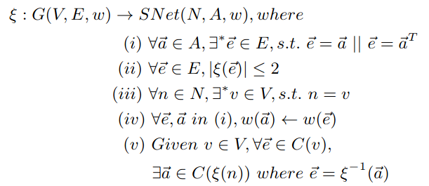

# My Google Map

## Table of Contents
1. Introduction
2. Stored Data
3. Preprocessing
4. Computing Quickest/Shortest Path
6. Efficiency and Feasibility
7. References
8. Conclusion

----
## Introduction
The fundamental problem at hand while designing a maps application is computing the shortest path between two locations. RPS+ algorithm [1] is used for finding the shortest feasible route. 

-----
## Stored Data
- Database for road networks throught the world will primarily be GPS data. GPS data will be processed to calculate distances between nodes. Also, I plan to use location info to have a database for offline utility. 
  
- You may also explain the size of data, and how would you suggest storing it?
  As we know the world road networks are huge and certainly all this data storage will be taking huge TBs of storage.
  
  It is impossible to have it all in the user's device and thus, the user's device will only contain data for neighbourhood regions.

---
## Preprocessing
Following network pre-processing is done:
- Weight Function 
  
  Appropriate weight parameters need to be defined in order to obtain correct shortest path. Using only the distance between nodes is not an optimum measure as in reality, road network is greatly affected by traffic, construction, blocking, jams, whatsoever.

  Distance and travel time will constitue the weight parameters.
  Real time travel data can be obtained by instantaneous GPS services. 

  I propose to have an ML model trained on GPS data for travel time. It can be used to get the weight for an edge in offline mode. Although it will require frequent updation, the same model can be used for a considerable period of time and updates can be delivered to users along with the app updates.

- Spatial Network Model[1]
  
  An actual road network can be modeled as a graph, G = (V,E,w) with a vertex set `V`, an edge set `E` and a weight function.  Each edge e, `e ∈ E` is associated with a weight w, `w(e):e→(R)`

  for calculation of the weight for each of the connections, several 
  |  | SNet : Newly generated spaitial network   A : Set of directed arc   N : set of Nodes  * : uniqueness  T : Transpose |
  | :---------------------------------------------: | :----------------------------------------------------------------------------------------------------------------------------------------- |
  |                                                 |                                                                                                                                            |

- Identifying important points and the routes less taken
  
  The road network will have a cumulative distance stored for certain important destinations. For example, surely some routes contain places like travel spots or hotels that are more of user's interest. These will distinguish between preferred and unpreferred routes and add to the weight of an edge.  

----
## Computing Quickest/Shortest Path
- The quickest path can be found by applying t the RSP+ algorithm to the processed data which will be available as a graph. The algorithm performs a target-oriented depth first search. Beginning from a given source node, following the edge with the least accumilative distance weight and terminates once the destination is reached.
  
Node failures can happen from time to time. A node failure temporarily puts this node down from the network so that the node cannot be traversed (rod bloackage, construction, or anything obstructing traffic flow). The algorithm has a SafeRoute[1] implementation which provides a fast-recovery heuristic of route regeneration.

In all, the algorithm successfully provides the quickest route considering real time traffic and route updation.

- Can you comment on the computation time without any heuristic?
 The computation time of the algorithm  depends on the average degree in the network.

- Mention the heuristics to speed up the computation. Time/Accuracy trade-off?
  RSP+ algorithm comes with a SafeRoute heuristic to handle route-regeneration.
  
- Will you be able to reroute quickly if the user takes a different turn?
  The instance of user taking a different turn can be adapted into the algorithm by considering it to be an event of node failure. Thus, the SafeRoute heuristic can be employed to take care of re-routing.

---
## Efficiency and Feasibility
- Theoretically, how would it perform?
  I think it will give accurate results even for for large area travesals, say 800km, because of the optimisation techniques and constant time lookup tables utilised in the algorithm. Although maintining such a huge database will take up TBs and more of space.
- Do you think it can work on the scale of the globe?
  
  The key idea is to cut a whole shortest path into small segments and return them in order. Multi-thread technologies areapplied to the whole computation process as those partial paths can be computed in parallel.

----
## References
$[1]$ [J. Sankaranarayanan and H. Samet. Query processingusing distance oracles for spatial networks.IEEETrans. Knowl. Data Eng, 22(8):1158–1175, 2010]: https://www.cise.ufl.edu/~mschneid/Research/papers/QS14IWCTS.pdf

----
## Conclusion
This was an idea to create Google Maps-like application which exploited a well built algorithm.

----