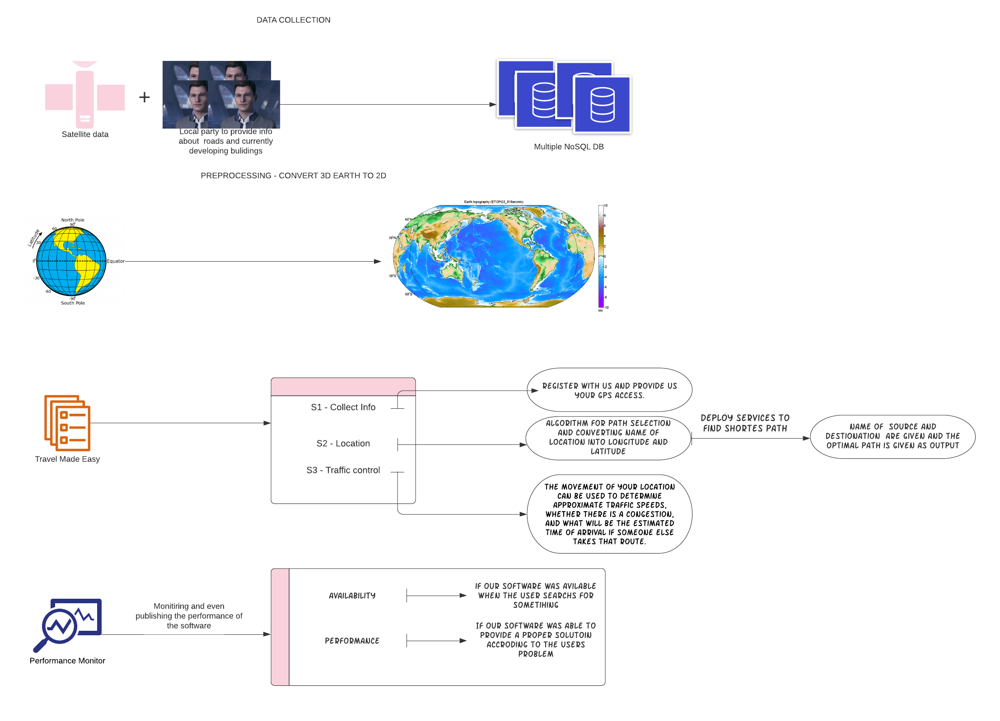
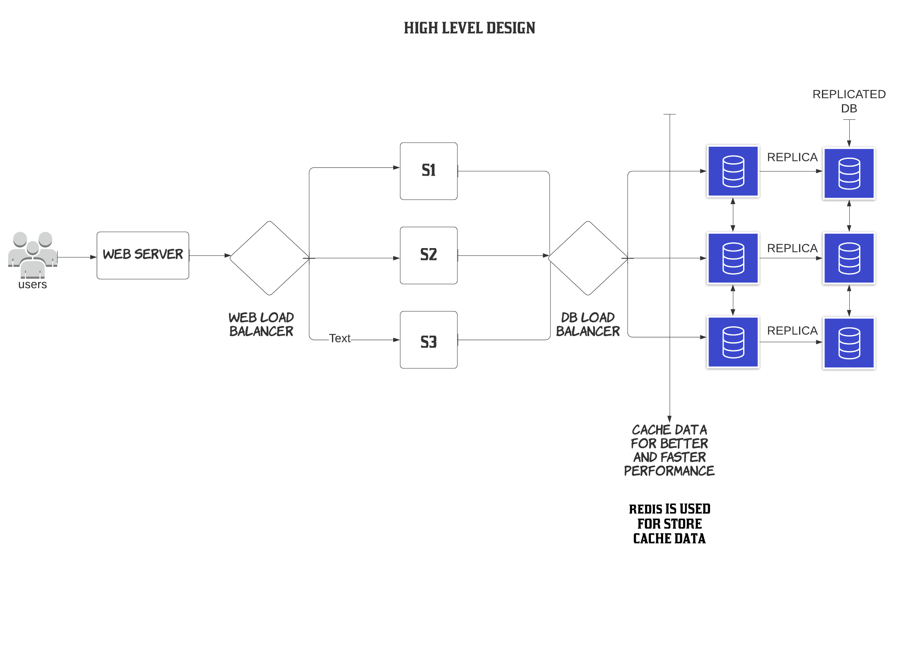

# Design your own Google Map

## Introduction
Google is the most popular search engine in the world, it processes almost 40,000 search queries every second, in short google has a huge amount of data to grant us every answer we need.  Not only this google is everywhere, from the best search engine to self-driving cars. This leads us to wonder how things work there. Here is my theory of how to create google maps like platform.
The logic is simple, a satellite which clicks photos of the whole world frequently, then a data center collects them and then overlaps them to obtain a single image a particular place, then do the same with other places and overlaps them again, which will finally give us a complete image of our earth, then it plots the live coordinates of a user through GPS tracking and shows them to us using amazing UI designs. Isn't it that simple, but there a lot going on in the back. Stick to the article and find out more detail.

## Stored Data
While first let's talk about a single user trying to get to a particular location, first we have to make sure that the images we have produced are accurate if that isn't true how one is supposed to get to a location, then here comes the hard part, obtaining the live coordinates of the user and plot them, we can't plot the coordinates on an image as the computer doesn't understand those images, so here we must use a specified data structures which can store the information of roads, building houses, etc. 
* There are data structures which can perform these task and one of them is R* tree which is feasible for storing maps-like data, i.e. buildings, schools, houses, etc. and GPS coordinates are stored using a KD tree. 
* Well the images for everyone are common but we have to use different KD trees to store the data of an individual which is going to cost  us TB's of data if we are talking about millions of users and the image alone is going to take TB's of data to store. NoSQL is the best way to store this type of data as it is unstructured and will be stored efficiently in NoSQL. 
* Example is suppose I want to store my location in the Data Base then my name i.e. Sagar's house is stored as 2 attributes Lattitude and Longtitude as a key- value pair in a dictionary.

## Preprocessing
There is a lot more going on in the back of just plotting our coordinates on a preprocessed graph. Here is what...
* So, one might want to optimize the cost of the route, this might seem a bit easy but it involves many complex calculations like,
  - Collecting and using traffic data so that slow roads are less likely to be chosen in the route calculation.
  - If a route with a few turns is only slightly longer than a route with many turns, it is likely to be a better choice for the driver.
* Intersections are also complex as not every turn is valid.
* Determine if the user has lost the previous track and now want a new path for the same destination is also a complex problem that requires A* algorithm to solve. 
*  Differences between states and countries that follow different rules for traffic control.
* What if the navigation device (e.g. cell phone) can only hold map data for nearby areas but the driver is on a long trip that sometimes travels out of the cell network.

## Computing Quickest/Shortest Path
* One of the most efficient solutions for the shortest path is **Dijkstra Algorithm** which is a greedy algorithm  and also a single pair shortest path algorithm which means it tells us the shortest path without analyzing the complete path, meaning if there are 2 ways that lead to a particular turn, then the shorter one is chosen independent of the fact, what comes next. But an all pair shortest algorithm can be more usefull like **Flyod Warshall** which is also best suited for Dense graph as the graph of the world is obviously going to be dense. For sparse graph like in hilly areas of the world we can also use **Johnson’s Algorithm** as it is well suited for this.
* Commenting on time without using heuristic is a difficult job, but this can be easily said as the data is stored in different types of binary trees, increasing number of nodes will affect a lot on the performance of the maps, that might even be an exponential increase in time complexity in the worst case and even constant in best case scenario.
* Nearest neighbor is a great algorithm which works fine in finding the shortest path, it gives us the optimal solution most of the time, but nothing is perfect right. So on average, it shows us 25% longer path then the shortest path also sometimes it shows us the worst result.
* Using precomputed information or inherent information contained in the data can improve the quality of results and also can minimize the time. 
* Rerouting the path is a very difficult job but this can be done as the data has to be processed again but will take a bit less time as some of it is already processed, So yes theoretically it would be able to find a new path to the same destination.

## Efficiency and Feasibility
* Theoretically, it would perform well but there must be loopholes in this as not even google maps was deployed in just one go. 
* Making software for limited users and doing the same for a huge amount of is two wholly different things, the software must pass some different levels of testing like Unit testing, Integration testing, System testing, Acceptance testing, Installation testing and many more, in short, it is nearly impossible to know if the software is ready to deploy or not for such a huge scale.

## References
* google.com
* quora.com
* stackoverflow.com
* khanacademy.com

## Conclusion
This was the general idea of how one can create google maps like platform, but it is much more difficult to implement all this experimentally but sometimes even ideas are more than enough to encourage us to do impossible things. 
 
